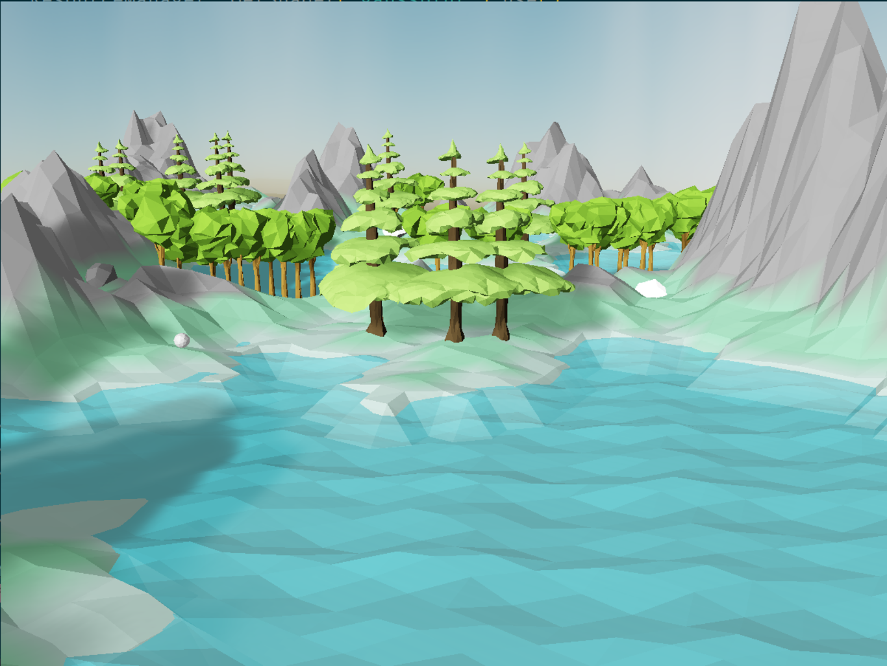
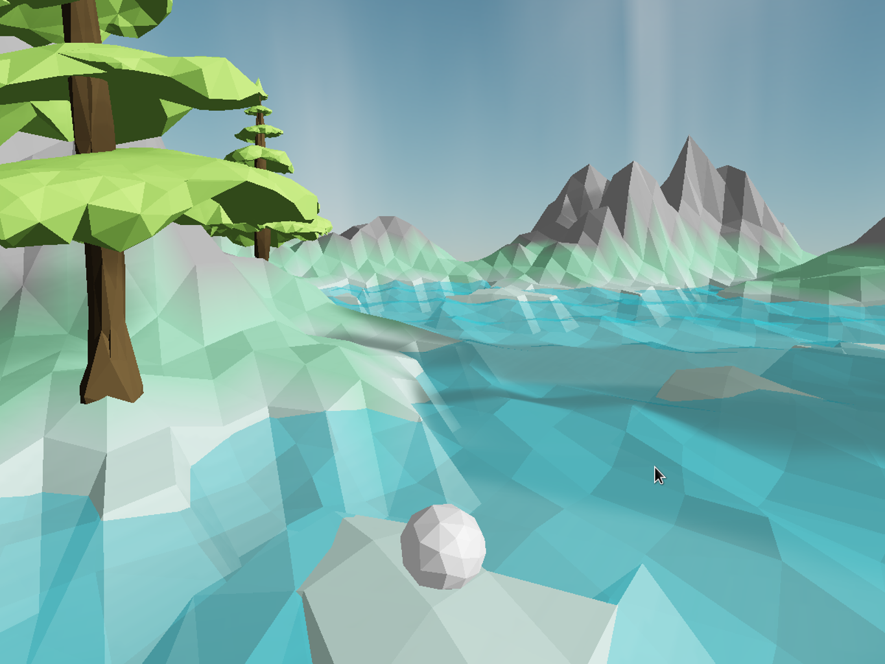
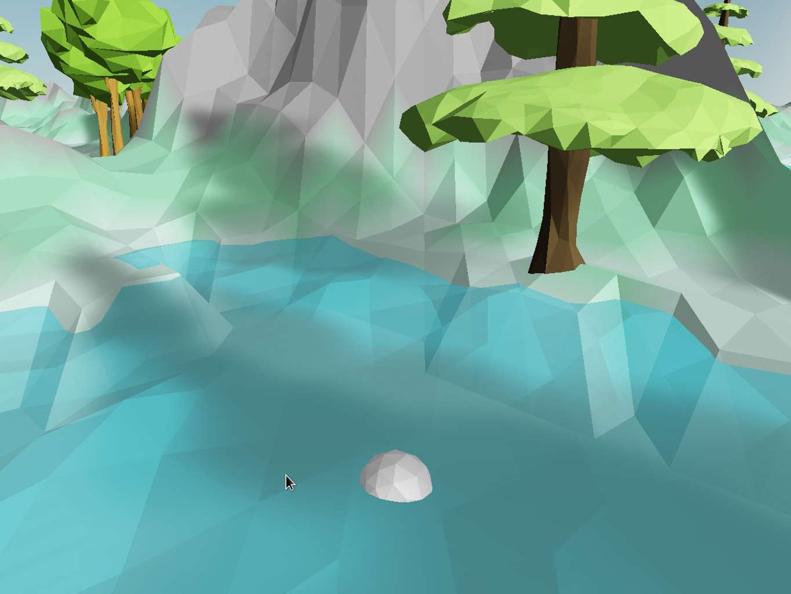
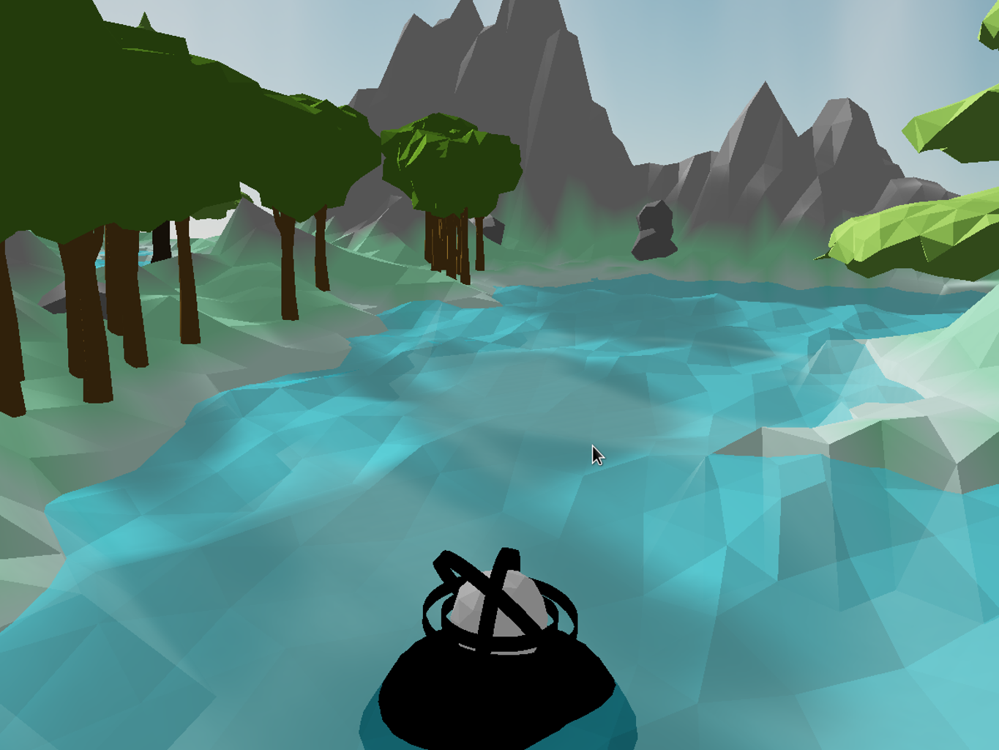
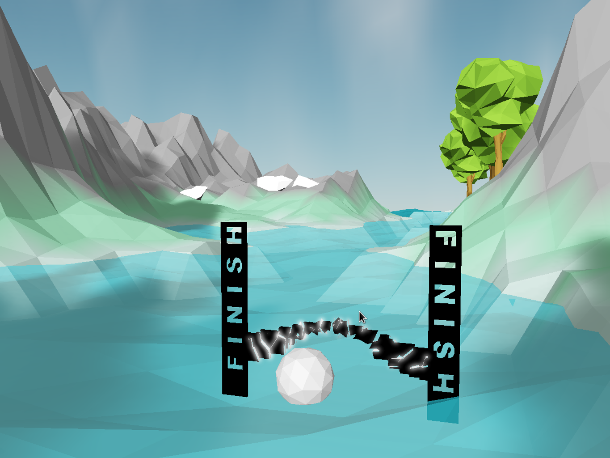

# Polyworld

## Introduction

This project is a low-poly style polyball game for Computer Graphics courses at ZJU.

Avaliable on PC and iOS platform.

## Example

PC Platform Video: [click me.](https://mega.nz/#!s6RiVADJ!61zPSIgOiLi4FjmNdk8foGUnIjjIxsgmtq4doSUvBSo)

### Scene

### Start Platform

### Finish Line

## Features

### Scene

- Infinite world with perlin noise to generate terrain
- Gerstner wave
- Parallel light
- Soft shadow with ESM
- HDR & Bloom
- Cloud based on perlin noise
- Skybox referance to [this repo](https://github.com/wwwtyro/glsl-atmosphere)
- Offline MSAA
- Start platform animation
- Finish line explosion

### Rendering

- All realtime rendering
- Instance draw all object (except ball)
- Run fluently on integrated graphics card

### Physics

- Scrolling effection with quaternion
- Collision check with terrian precisely
- Collision check with tree and stone

## How to run

### PC Platform

Development base on OpenGL.

You need several tools:
- CMake
- gcc
- glfw3
- glad
- Assimp
- GLM
- FreeType

#### For linux user

See [CmakeLists.txt](PC/CMakeLists.txt) to put the header and lib in correct location.

All header in `OpenGLStuff/header` and all lib in `OpenGLStuff/lib`, `glad.c` in `OpenGLStuff/src`.

## Authors

PC version is developed by [dydxh](https://github.com/dydxh).

iOS version is developed by [Sxy](https://github.com/sxy623).

